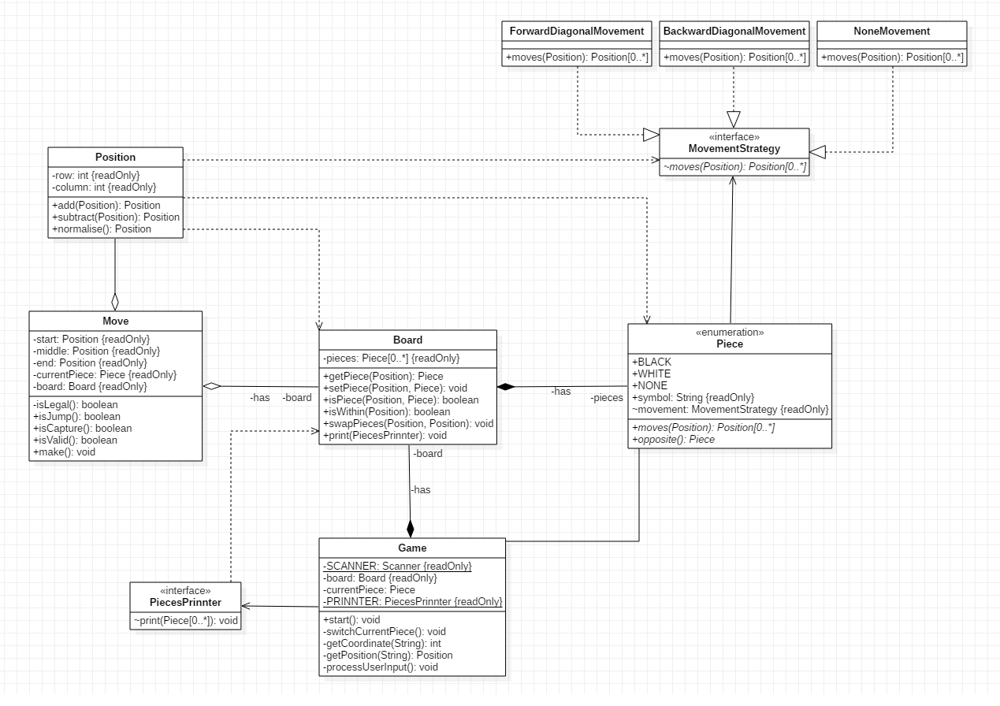

# object-oriented-draughts

---

## Description

Assignment 3 for [Agile Object-oriented Software Development](https://kurser.dtu.dk/course/02160).

## UML Class Diagram

## Credits

Bartłomiej Jabłoński

## License

Copyright (C) 2019, Bartłomiej Jabłoński - All Rights Reserved  
Unauthorized copying of this project, via any medium is strictly prohibited  
Proprietary and confidential  
Written by Bartłomiej Jabłoński <jablonskiba@gmail.com>, February 27